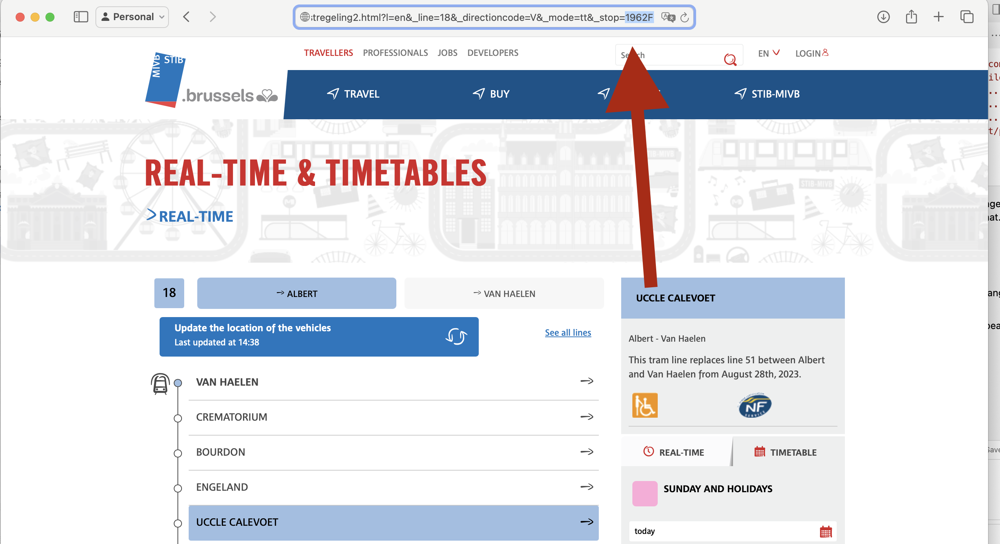
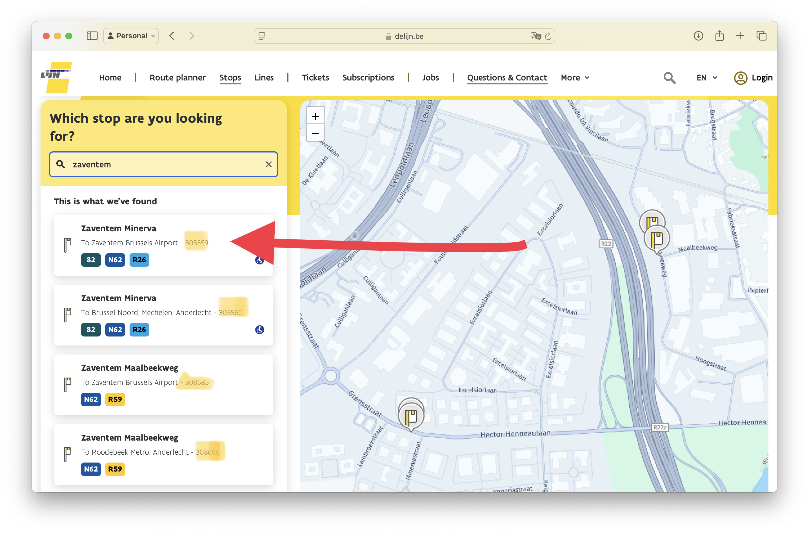
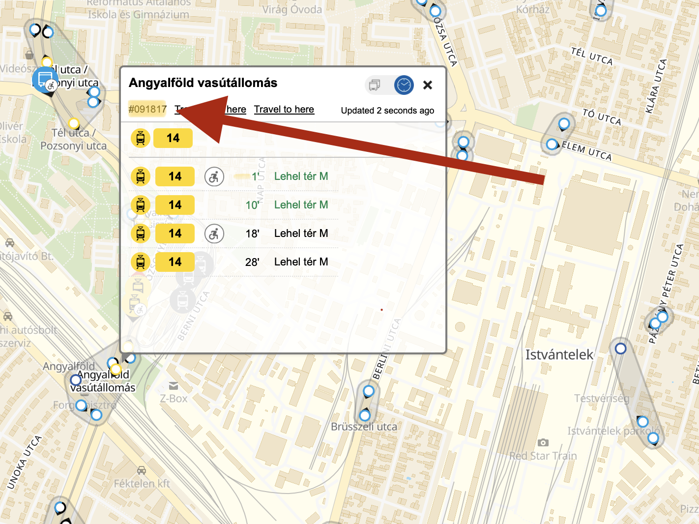
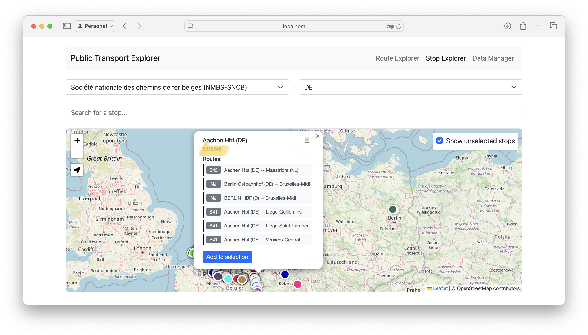

# Finding Transit Stop IDs

This guide explains how to find stop IDs for different transit providers. The stop ID is required to set up transit monitoring for your display.

## Quick Methods for Real-time Providers

### STIB (Brussels)
1. Go to the [STIB website](https://www.stib-mivb.be/)
2. Click on a line that passes through your stop of interest
3. Select your direction and click on your specific stop
4. In your browser's URL, look for a part that looks like `_stop=4213`
5. The number after `_stop=` is your stop ID

### De Lijn (Flanders)
1. Go to the [De Lijn website](https://www.delijn.be/en/)
2. Select "Stops" in the menu
3. Enter your stop's name in the search bar
4. In the suggestions that load, look for the small number next to the stop name
5. This number is your stop ID

### BKK (Budapest)
1. Go to the [BKK Trip Planner](https://futar.bkk.hu)
2. Find your stop on the map
3. In the popup that appears in the top left corner, there will be a number starting with a #
4. The stop ID is that number (without the hashtag)

### SNCB (Belgian Railways)
Currently, there is no easy way to find SNCB stop IDs through their website. Please use one of the advanced methods below.

## Advanced Methods

### Using Stop Explorer
If your device can handle it (not recommended for Raspberry Pi), you can use the Stop Explorer interface:

1. Set up the [brussels_transit package](https://github.com/bdamokos/brussels_transit)
2. Access the Stop Explorer interface
3. Search for your stop
4. The interface will show the stop ID

Note: The interface and GTFS data processing can be resource-intensive. It's recommended to run this on a desktop computer or server rather than directly on the Raspberry Pi.

### Manual GTFS Method
For any provider (including those without real-time data):

1. Download the GTFS schedule from your chosen provider
2. Open the zip file
3. Find and open `stops.txt`
4. Look for your stop name and note the associated stop ID
5. If there are multiple IDs for the same stop name, you may need to experiment to find the one that serves your specific line and direction

## Line IDs (Advanced)

Some providers allow filtering by line ID:

- **STIB**: You can use the line number, but this will disable fallback to GTFS schedule because the line number used in the real-time API is different from the route ID used in the GTFS Schedule.
- **BKK**: Must use the route_id (different from the line number shown on vehicles)
- **De Lijn**: ? (Line number works for the real-time API, not sure about the GTFS Schedule)
- **Other providers**: Use the route_id from their GTFS feed 