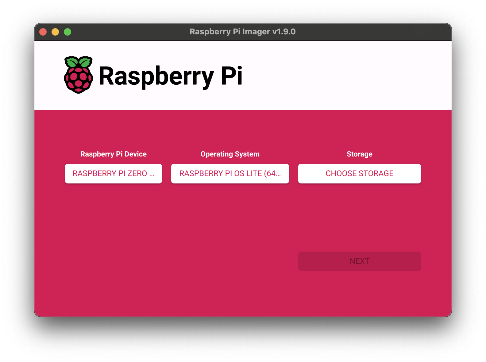

# Setting up the Raspberry Pi

# Prepare the SD card

Using Raspberry Pi Imager, download the Raspberry Pi OS Lite (64-bit) or Raspberry Pi OS Desktop (64-bit) image onto a microSD card.




Under settings:
- Enable SSH
- Set up username and password
- Input WiFi network name and password
- Check the hostname (default is raspberrypi.local)

# Get the Raspberry Pi assembled and powered on

Once the Raspberry Pi is assembled and powered on, connect to it with SSH.
``` bash
ssh <username>@raspberrypi.local
```

> **:bulb: TIP:** Fast Setup
> If you want to automatically set up everything, you can use our setup script:
> 
> ``` bash
> # Download the setup script (with cache bypass)
> curl -H "Cache-Control: no-cache" -O https://raw.githubusercontent.com/bdamokos/rpi_waiting_time_display/main/setup_display.sh
> 
> # Make it executable
> chmod +x setup_display.sh
> ```
>  
> ``` bash
> # Run the setup script
> sudo ./setup_display.sh
> ```
> 
> The script will:
> - Enable SPI interface
> - Install all required packages
> - Set up watchdog
> - Clone repositories
> - Set up virtual environment
> - Install requirements
> - Configure and start the service
> 
> After running the script, you only need to:
> 1. Edit your .env file with your settings
> 2. Reboot the Raspberry Pi
>
> You can skip the manual setup steps below if you used the setup script.

# Manual Setup

Commands to get started:

sudo raspi-config:
- turn on Raspberry Pi Connect
- turn on the SPI interface

Install git and github CLI:

``` bash
sudo apt-get update
sudo apt-get install git
sudo apt-get install gh
```

Login to github:
``` bash
gh auth login
```

Clone the repository:
``` bash
gh repo clone bdamokos/rpi_waiting_time_display
```

Rename the folder to display_programme:
``` bash
mv rpi_waiting_time_display display_programme
```

Set up the virtual environment:
``` bash
python3 -m venv ~/display_env
source ~/display_env/bin/activate
pip install -r requirements.txt
```

To set up the service with systemd, copy the [display.service](service/display.service.example) file to the /etc/systemd/system directory and enable it with:
``` bash
sudo cp ~/display_programme/docs/service/display.service.example /etc/systemd/system/display.service
sudo systemctl enable display.service
sudo systemctl start display.service
```
If you don't already have the DejaVuSans font installed, you can install it with:
``` bash
sudo apt-get install ttf-dejavu
```

To setup watchdog (in case the display freezes, it will reboot the Pi):

Add these parameters to /boot/firmware/config.txt:
``` bash
sudo nano /boot/firmware/config.txt
```
Add the following line:
``` bash
dtparam=watchdog=on
```

Then install watchdog:
``` bash
sudo apt-get install watchdog
```

Edit the watchdog configuration file:
``` bash
sudo nano /etc/watchdog.conf
```
Put in the following:
``` bash
# Add or uncomment these lines:
watchdog-device = /dev/watchdog
watchdog-timeout = 15
interval = 10
max-load-1 = 3.0
max-load-5 = 2.8
```

Then enable the watchdog service:
``` bash
sudo systemctl enable watchdog
sudo systemctl start watchdog
```

Copy the [switch_display_mode.sh](service/switch_display_mode.sh) file to the ~/ directory and make it executable:
``` bash
sudo cp ~/display_programme/docs/service/switch_display_mode.sh ~/switch_display_mode.sh
sudo chmod +x ~/switch_display_mode.sh
```

##### If running outside docker:

Also copy the [start_display.sh](service/start_display.sh.example) file to the ~/ directory and make it executable:
``` bash
sudo cp ~/display_programme/docs/service/start_display.sh.example ~/start_display.sh
sudo chmod +x ~/start_display.sh
```

##### If running with the docker version:

Copy the [start_display.sh](service/start_display.sh.docker.example) file to the ~/ directory and make it executable:
``` bash
sudo cp ~/display_programme/docs/service/start_display.sh.docker.example ~/start_display.sh
sudo chmod +x ~/start_display.sh
```

In either case, change the username in the [display.service](service/display.service.example) file to the username of the account you are using.

Onece done, create the .env file by renaming the .env.example file:
``` bash
mv .env.example .env
```
Then fill in the values for the variables.
``` bash
nano .env
```

Add in missing Waveshare drivers depending on your display:
``` bash
curl -H "Cache-Control: no-cache" -o "$SITE_PACKAGES/epd2in13g.py" https://raw.githubusercontent.com/waveshareteam/e-Paper/master/E-paper_Separate_Program/2in13_e-Paper_G/RaspberryPi_JetsonNano/python/lib/waveshare_epd/epd2in13g.py
curl -H "Cache-Control: no-cache" -o "$SITE_PACKAGES/epd2in13g_V2.py" https://raw.githubusercontent.com/waveshareteam/e-Paper/master/E-paper_Separate_Program/2in13_e-Paper_G/RaspberryPi_JetsonNano/python/lib/waveshare_epd/epd2in13g_V2.py
curl -H "Cache-Control: no-cache" -o "$SITE_PACKAGES/epdconfig.py" https://raw.githubusercontent.com/waveshareteam/e-Paper/master/E-paper_Separate_Program/2in13_e-Paper_G/RaspberryPi_JetsonNano/python/lib/waveshare_epd/epdconfig.py
```

The service should start automatically on boot (sudo reboot). If it doesn't, check the logs with:
``` bash
journalctl -u display.service
```

> **:bulb: TIP:** Optional: Enable File Sharing
> If you want to easily edit files on the Raspberry Pi from another computer, you can set up Samba file sharing:
> ``` bash
> # Download the Samba setup script
> curl -O https://raw.githubusercontent.com/bdamokos/rpi_waiting_time_display/main/docs/service/setup_samba.sh
> 
> # Make it executable
> chmod +x setup_samba.sh
> 
> # Run the setup script
> sudo ./setup_samba.sh
> ```
> 
> After running the script, you can access your home directory from:
> - Windows: `\\raspberrypi.local\username_home`
> - macOS: `smb://raspberrypi.local/username_home`
> - Linux: `smb://raspberrypi.local/username_home`
> (or whatever hostname you set)
> This makes it easier to edit files like `.env` from your main computer.


# Setting up the backend server
:warning: **Important:** The backend server needs to be set up first. See the [backend server readme](https://github.com/bdamokos/brussels_transit) for more information. If the API keys are not configured, the service will not start.
