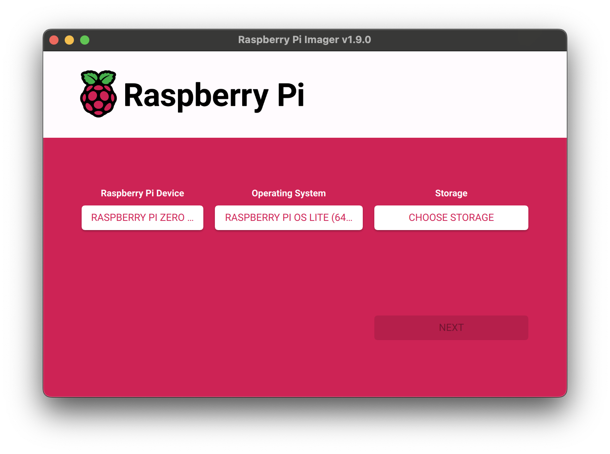
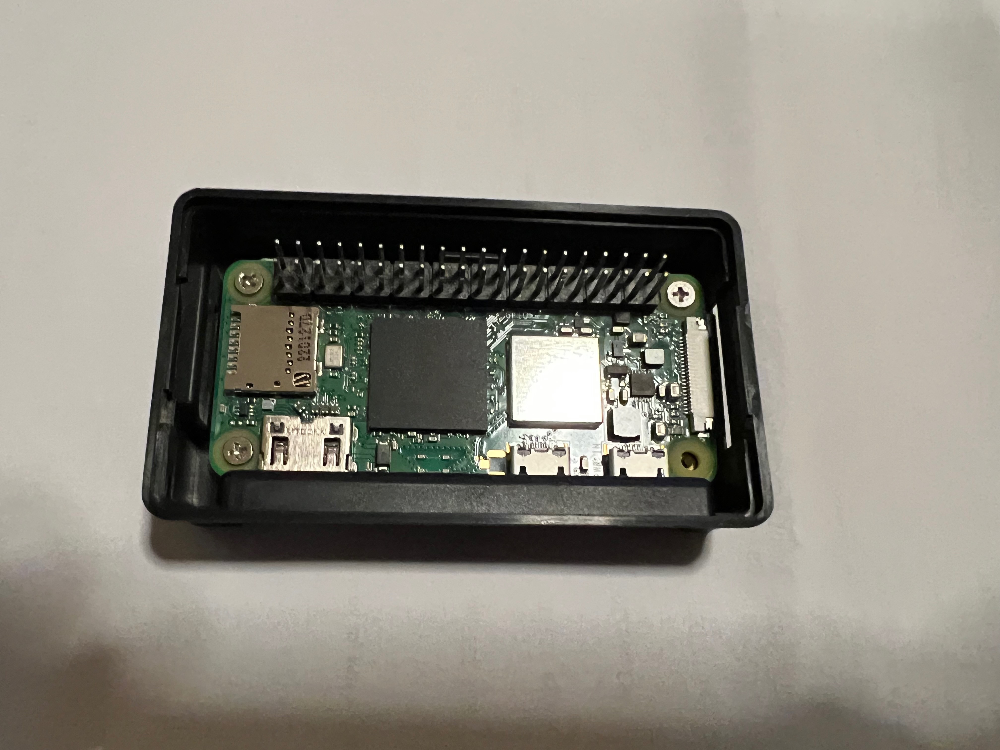
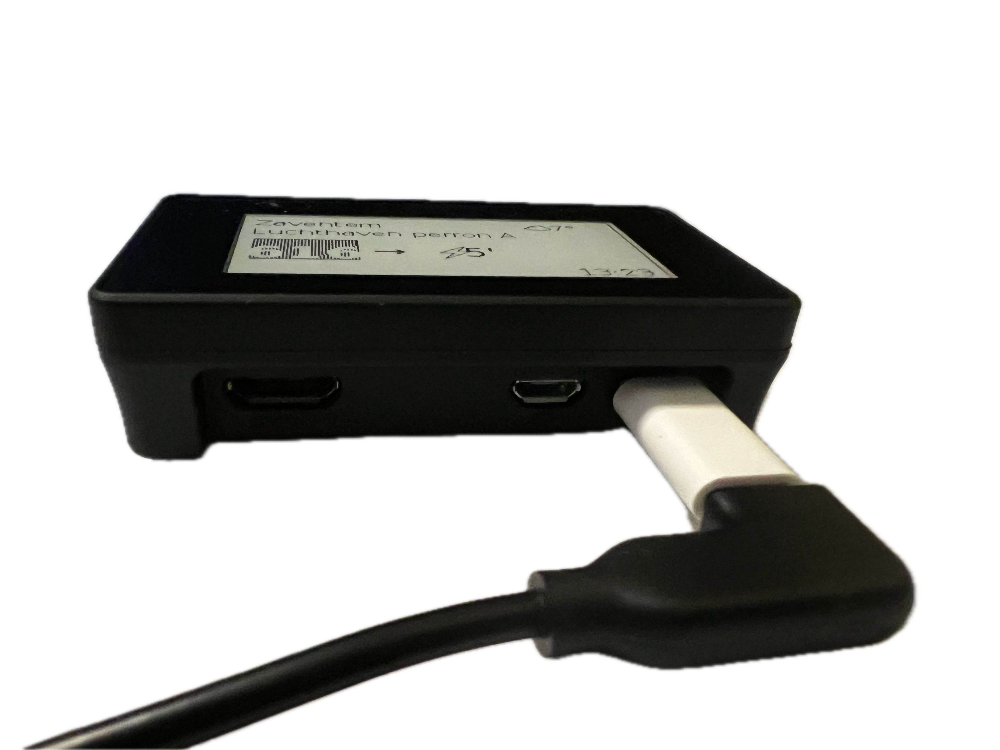
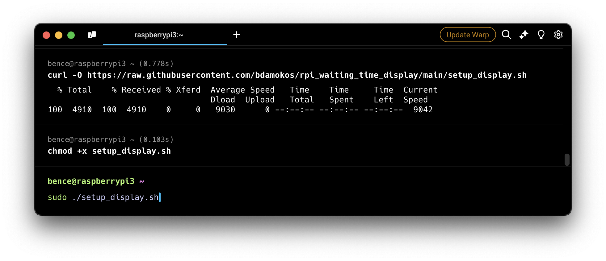
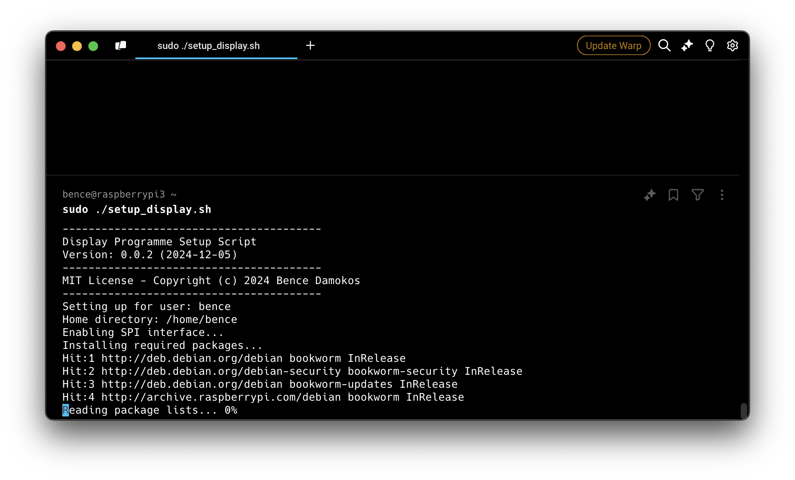
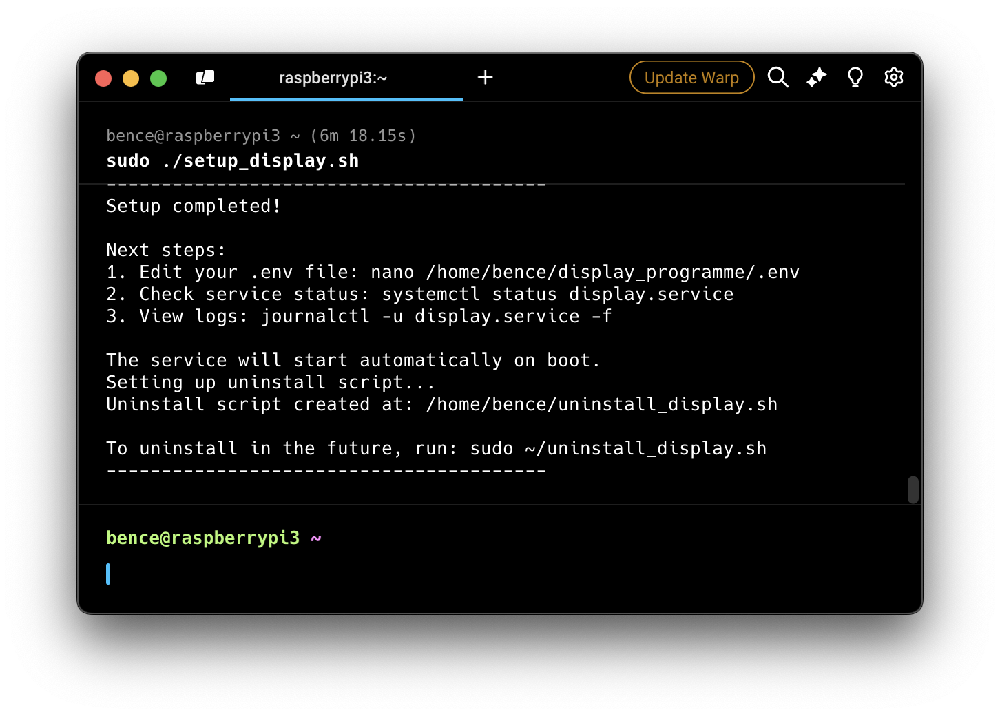

# Setting up the Raspberry Pi

# Prepare the SD card

Using Raspberry Pi Imager, download the Raspberry Pi OS Lite (64-bit) or Raspberry Pi OS Desktop (64-bit) image onto a microSD card.




Under settings:
- Enable SSH
- Set up username and password
- Input WiFi network name and password
- Check the hostname (default is raspberrypi.local)

# Hardware setup

The hardware setup is quite straightforward:
- If you have a case, follow the instructions in the case's documentation. With the case I had, this included:
    - Adding a thermal pad to the bottom of the case
    - Screwing the Raspberry Pi into the case with 4 screws

    

    - Removing the film from the back of the screen and sticking it to the top of the case
    - Carefully aligning the pin sockets on the display with the pins on the Raspberry Pi and firmly pressing them together
    - Plug in the microSD card
    - Plugging in the display to either USB-C (with the adapter) or micro-USB (important, that one USB port is for power only, the second for data, this is marked on the case)


- Without a case, you just need to press the display into the Raspberry Pi, making sure that you seat the screen firmly onto the pins (the bottom of the display's board should more or less touch the top of the Raspberry Pi's board), and plug in the microSD card.


# Get the Raspberry Pi assembled and powered on

Once the Raspberry Pi is assembled and powered on, connect to it with SSH.
``` bash
ssh <username>@raspberrypi.local
```

# Software Setup
Use the setup script to automatically set up everything.

``` bash
# Download the setup script (with cache bypass)
curl -H "Cache-Control: no-cache" -O https://raw.githubusercontent.com/bdamokos/rpi_waiting_time_display/main/setup_display.sh

# Make it executable
chmod +x setup_display.sh

# Run the setup script
sudo ./setup_display.sh
```
 


The script will:
- Enable SPI interface
- Install all required packages
- Set up watchdog
- Clone repositories
- Set up virtual environment
- Install requirements
- Configure and start the service

After running the script, you only need to:
1. Edit your .env file with your settings (the script will start a web interface to help you with that)
2. Reboot the Raspberry Pi (the script will also do that for you)


# Setting up the backend server
:warning: **Important:** The backend server needs to be set up for the display to work (otherwise the display will only display the weather). See the [backend server readme](https://github.com/bdamokos/brussels_transit) for more information. If the API keys are not configured, the service will not start.

**Currently the set up script installs the backend server, but it does not configure it.** You need to set up the API keys manually and make sure that the backend server is monitoring the same stops as are requested by your display.
