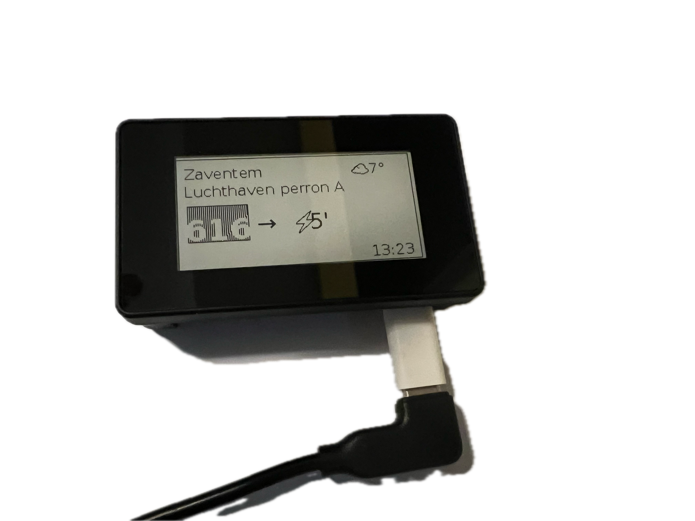

# Setting up the Raspberry Pi

Use this guide to set up your Raspberry Pi fully manually. You can use the other guide if you prefer to use the built in configuration interface once you have the basic setup done.

# Prepare the SD card

Using Raspberry Pi Imager, download the Raspberry Pi OS Lite (64-bit) or Raspberry Pi OS Desktop (64-bit) image onto a microSD card.


Under settings:
- Enable SSH
- Set up username and password
- Input WiFi network name and password
- Check the hostname (default is raspberrypi.local)

# Hardware setup

The hardware setup is quite straightforward:
- If you have a case, follow the instructions in the case's documentation. With the case I had, this included:
    - Adding a thermal pad to the bottom of the case
    - Screwing the Raspberry Pi into the case with 4 screws

    

    - Removing the film from the back of the screen and sticking it to the top of the case
    - Carefully aligning the pin sockets on the display with the pins on the Raspberry Pi and firmly pressing them together
    - Plug in the microSD card
    - Plugging in the display to either USB-C (with the adapter) or micro-USB (important, that one USB port is for power only, the second for data, this is marked on the case)


- Without a case, you just need to press the display into the Raspberry Pi, making sure that you seat the screen firmly onto the pins (the bottom of the display's board should more or less touch the top of the Raspberry Pi's board), and plug in the microSD card.

# Get the Raspberry Pi assembled and powered on

Once the Raspberry Pi is assembled and powered on, connect to it with SSH.
``` bash
ssh <username>@raspberrypi.local
```

# Software Setup
Use the setup script to automatically set up everything.

``` bash
# Download the setup script (with cache bypass)
curl -H "Cache-Control: no-cache" -O https://raw.githubusercontent.com/bdamokos/rpi_waiting_time_display/main/setup_display.sh

# Make it executable
chmod +x setup_display.sh

# Run the setup script
sudo ./setup_display.sh
```
 

The script will guide you through several configuration options:
- Setup mode (Normal/Docker/Remote)
- Display type (e.g., epd2in13g_V2 for 4-color displays, epd2in13_V4 for black and white displays)
- Update mode (Releases/Main/None)
- Optional Samba file sharing setup
- Auto-restart preference

The script will then:
- Enable SPI interface
- Install all required packages
- Set up watchdog
- Clone repositories
- Set up virtual environment
- Install requirements
- Configure and start the service
- Set up WebSerial support (may require a reboot)

If the script needs to enable WebSerial support, it will:
1. Enable the required hardware module
2. Reboot the system
3. After reboot, you'll need to run:
```bash
sudo bash ~/display_programme/docs/service/setup_webserial.sh
```
to complete the WebSerial setup.


After running the script, you only need to:
1. Edit your .env file with your settings (you can do this in two ways):
   - Using the web interface at http://raspberrypi.local:5002/debug/env
   - Manually editing the file: `nano ~/display_programme/.env`
   - Using the webserial interface at https://bdamokos.github.io/rpi_waiting_time_display/setup/
2. Reboot the Raspberry Pi (if not done automatically by the script)



# Setting up the backend server
:warning: **Important:** The backend server needs to be set up for the display to work (otherwise the display will only display the weather and flights). See the [backend server readme](https://github.com/bdamokos/brussels_transit) for more information. If the API keys are not configured, the service will not start. (Some basic setup, like the API keys, can be done through the [webserial interface](https://bdamokos.github.io/rpi_waiting_time_display/setup/) if the backend server is set up on the Raspberry Pi.)

The setup script will install the backend server based on your chosen setup mode:
- Normal mode: Installs directly on the Raspberry Pi
- Docker mode: Sets up in a Docker container
- Remote mode: Requires you to set up the backend server separately

You'll need to configure the API keys and stops either through:
- The web interface at http://raspberrypi.local:5002/debug/env
- Manually editing the .env file
