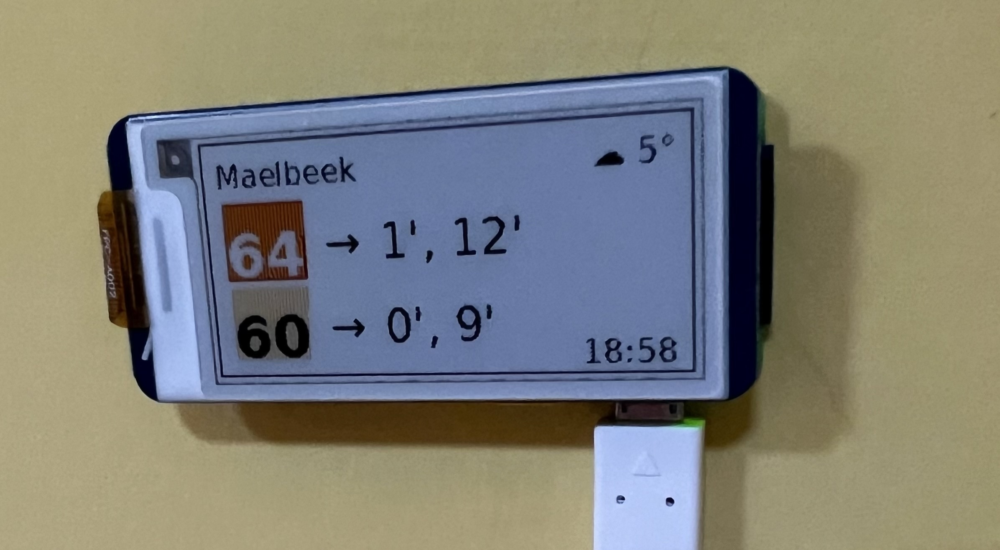

# Waiting Times Pi Display

A Raspberry Pi project that displays bus waiting times using an e-Paper display (Waveshare 2.13" G V2).

## Features
- ☀️ Weather conditions and temperature
- 🚌 Next bus arrival times for configured lines (STIB/MIVB, DeLijn, BKK)
- 📡 Easy WiFi setup via QR code (needs further testing) or by plugging the display to your computer and using the setup page on the [website](https://bdamokos.github.io/rpi_waiting_time_display/setup/)
- ✈️ Optional: Overhead flight tracking
- 🛰️ Optional: ISS tracking when visible

[View detailed features and screenshots →](https://bdamokos.github.io/rpi_waiting_time_display/features/)

## Quick Start
1. [Set up your Raspberry Pi](https://bdamokos.github.io/rpi_waiting_time_display/setting-up-the-rpi/)
2. Connect your display via USB
3. Open the [setup interface](https://bdamokos.github.io/rpi_waiting_time_display/setup/) to configure

## Requirements
- Raspberry Pi (tested on Zero 2W)
- Waveshare 2.13" e-Paper display (see [supported models](https://bdamokos.github.io/rpi_waiting_time_display/hardware/))
- [Transit data server](https://github.com/bdamokos/brussels_transit) (can run on the same Pi)

### Optional API Keys
Some features require API keys. [See what's available with and without API keys →](https://bdamokos.github.io/rpi_waiting_time_display/api-features/)
- [OpenWeatherMap](https://openweathermap.org/appid) - for weather data
- [AeroAPI](https://www.flightaware.com/commercial/aeroapi) - for enhanced flight data

## Hardware Cost
Basic setup (Raspberry Pi Zero 2W + display): **~€60**
[View detailed hardware guide →](https://bdamokos.github.io/rpi_waiting_time_display/hardware/)

## Need Help?
- [Debugging interface](https://bdamokos.github.io/rpi_waiting_time_display/features/#debugging)
- [Create an issue](https://github.com/bdamokos/rpi_waiting_time_display/issues)

## Inspiration and Acknowledgments
- A video ad STIB made for their mobile app that inspired this project:
  
- [UK train departure display](https://github.com/chrisys/train-departure-display) - A similar project for UK trains
- [Font Awesome Free](https://fontawesome.com) - Icons used in the setup interface under the [Font Awesome Free License](https://fontawesome.com/license/free)

