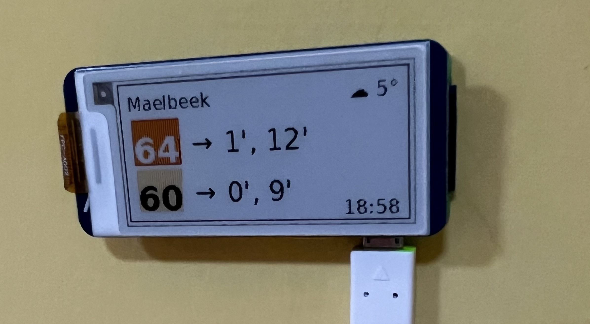
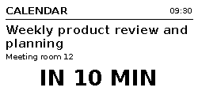
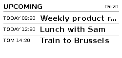
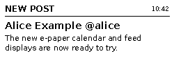
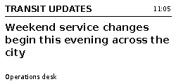
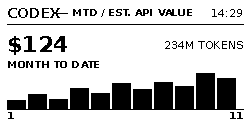
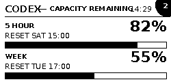
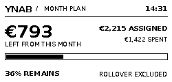
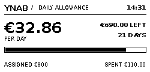
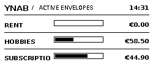

# Waiting Times Pi Display

A Raspberry Pi project that displays bus waiting times using an e-Paper display (Waveshare 2.13" G V2).

## Features
- ☀️ Weather conditions and temperature
- 🚌 Next bus arrival times for configured lines (STIB/MIVB, DeLijn, SNCB/MIVB, BKK)
- 📡 Easy WiFi setup via QR code (needs further testing) or by plugging the display to your computer and using the setup page on the [website](https://bdamokos.github.io/rpi_waiting_time_display/setup/)
- ✈️ Optional: Overhead flight tracking
- 🛰️ Optional: ISS tracking when visible
- 📊 Optional: Scheduled token-usage dashboards with month-to-date estimates and remaining-capacity bars
- 💶 Optional: Read-only YNAB views based only on the current month's assignments
- 📅 Optional calendar plugin with upcoming-event alerts and agenda glances
- 📰 Optional RSS/Nitter plugin with compact new-entry notifications
- 🎛️ Screen arbitration, weekday-aware schedules, and a private-network display override API

[View detailed features and screenshots →](https://bdamokos.github.io/rpi_waiting_time_display/features/)

## Optional Display Plugins

The calendar and RSS plugins share the screen safely with transit, weather,
flight, ISS, and Codex views through the screen arbiter. Each plugin is disabled
by default and configured in the untracked `.env` file.

### Calendar

Read one or more iCalendar feeds to show a focused countdown before an event or
a brief upcoming agenda. Feed URLs may be remote secret iCal links or local
files. See [calendar setup and privacy notes](docs/calendar-display.md).

| Upcoming event | Agenda glance |
| --- | --- |
|  |  |

### RSS and Nitter

Watch standard RSS/Atom feeds or configurable Nitter feeds. The first poll
establishes a baseline, then new entries appear as short, queued notifications
without putting feed URLs on the display. See [RSS watch setup](docs/rss-watch-display.md).

| Nitter post | RSS article |
| --- | --- |
|  |  |

### Codex usage views

The token-usage display can run only while Codex is active or stay scheduled
with `token-always`. Schedules support weekday/weekend rules, and the capacity
view includes a corner badge when banked resets are available. See
[token usage setup](docs/token-usage-display.md).

| Month-to-date estimate | Remaining capacity |
| --- | --- |
|  |  |

### Screen control

The screen arbiter gives temporary alerts predictable priority and returns to
the scheduled base view afterward. A local/private-network API can temporarily
request the token, weather, transit, or calendar screen. See the
[arbiter](docs/screen-arbiter.md) and [display override API](docs/display-override-api.md)
documentation.

### YNAB monthly budget views

YNAB screens distinguish current-month spending permission from historical
rollover. They never treat Ready to Assign as safe-to-spend money. See the
[configuration and calculation policy](docs/ynab-display.md).

| Monthly plan | Daily allowance | Active envelopes |
|---|---|---|
|  |  |  |

The screenshots use invented names and amounts. No account, budget, category,
payee, transaction, or credential from a real YNAB budget is committed.

## Quick Start
1. [Set up your Raspberry Pi](https://bdamokos.github.io/rpi_waiting_time_display/setting-up-the-rpi-webserial)
2. Connect your display via USB
3. Open the [setup interface](https://bdamokos.github.io/rpi_waiting_time_display/setup/) to configure

## Requirements
- Raspberry Pi (tested on Zero 2W)
- Waveshare 2.13" e-Paper display (see [supported models](https://bdamokos.github.io/rpi_waiting_time_display/hardware/))
- [Transit data server](https://github.com/bdamokos/brussels_transit) (can run on the same Pi)

### Optional API Keys
Some features require API keys. [See what's available with and without API keys →](https://bdamokos.github.io/rpi_waiting_time_display/api-features/)
- [OpenWeatherMap](https://openweathermap.org/appid) - for weather data
- [AeroAPI](https://www.flightaware.com/commercial/aeroapi) - for enhanced flight data

## Hardware Cost
Basic setup (Raspberry Pi Zero 2W + display): **~€60**
[View detailed hardware guide →](https://bdamokos.github.io/rpi_waiting_time_display/hardware/)

## Need Help?
- [Debugging interface](https://bdamokos.github.io/rpi_waiting_time_display/features/#debugging)
- [Create an issue](https://github.com/bdamokos/rpi_waiting_time_display/issues)

## Inspiration and Acknowledgments
- A video ad STIB made for their mobile app that inspired this project:
  
- [UK train departure display](https://github.com/chrisys/train-departure-display) - A similar project for UK trains
- We are grateful to the providers of the APIs we use, listed at [API Features](https://bdamokos.github.io/rpi_waiting_time_display/api-features/). 
- Certain included data and assets are under a specific license:
  - [Font Awesome Free](https://fontawesome.com) - Icons used in the setup interface under the [Font Awesome Free License](https://fontawesome.com/license/free), icons used in the display under Creative Commons Attribution 4.0 International License
  - [Open-Meteo](https://open-meteo.com/) - Weather data under a [Creative Commons Attribution 4.0 International License](https://creativecommons.org/licenses/by/4.0/)

