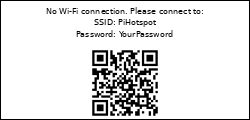
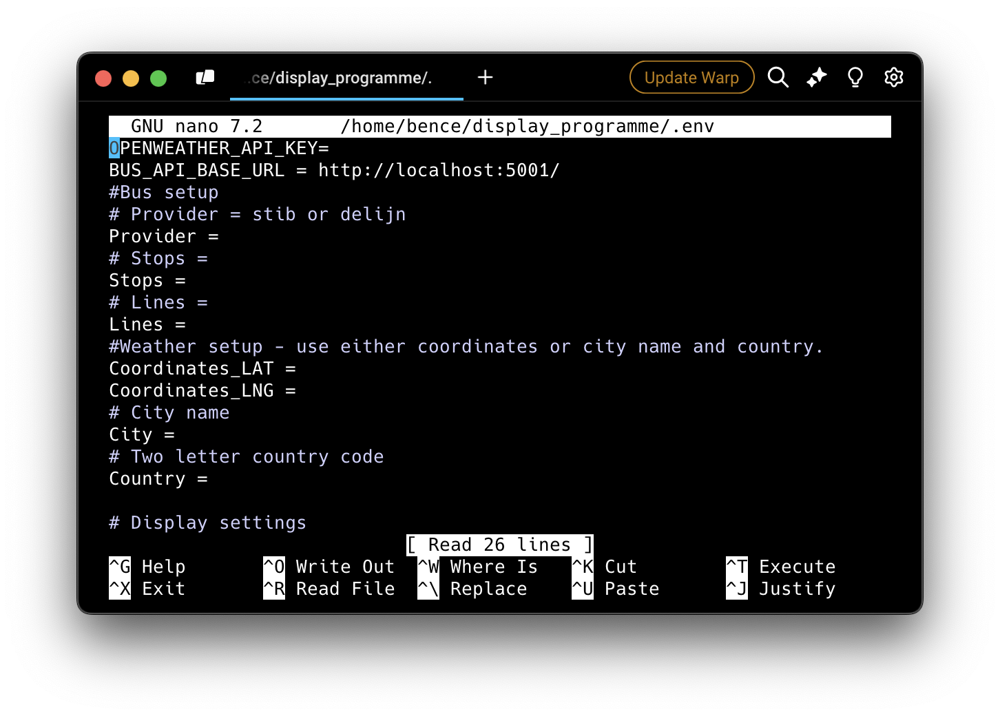

# Waiting Times Pi Display

A Raspberry Pi project that displays bus waiting times using an e-Paper display (Waveshare 2.13" G V2).


Features:
- Current time
- Weather conditions and temperature (including a weather mode when no bus is coming soon)

- Next bus arrival times for configured lines
- Color-coded bus line numbers matching STIB/MIVB official colors
- If the Raspberry Pi is not connected to the internet, it will set up a hotspot and display a QR code to connect to it that allows you to connect the Pi to the internet



# Requirements
The server from https://github.com/bdamokos/brussels_transit is set up and is providing data for the stop we are interested in.

An API key for OpenWeatherMap is required to get the weather data.

## Hardware
Tested with:

Systems:
- [Raspberry Pi Zero 2W](https://www.raspberrypi.com/products/raspberry-pi-zero-2-w/)
  - Board with headers: ~€20
  - MicroSD card: €10-15 (tested with 16 and 32GB, should work with 8GB)
  - Official charger: €8 (if not using existing charging cable)
  - [USB-C to micro-USB adapter](https://www.raspberrypi.com/products/usb-b-to-usb-c-adapter/): €1

Displays:
- [Waveshare 2.13" G V2 e-Paper display](https://www.waveshare.com/2.13inch-e-Paper-HAT-G.htm) (black, white, red, yellow; no partial refresh support[^1]; ~€20) - display driver set as epd2in13g_V2 in the .env file
- [Waveshare 2.13" e-Paper display](https://www.waveshare.com/2.13inch-e-paper-hat.htm) (black, white; partial refresh support; ~€20) - display driver set as epd2in13_V4 in the .env file
- [Waveshare 2.13" e-Paper display with case](https://www.waveshare.com/2.13inch-Touch-e-Paper-HAT-with-case.htm) (black, white; partial refresh support; ~€20) - display driver set as epd2in13_V4 in the .env file

Total cost of components: ~€60

Can be extended with:
-- Battery pack, e.g. Pisugar 3
-- Case, e.g. 3D printed case or the one that comes with the display

[^1]: The four colour version of the display does not support partial refresh, so it flickers with every refresh, making it less ideal for this application, despite the nice colours.

# Configuration

The .env file is used to configure the application:
- Add your openweather API key
- Input your location
- Configure the monitored transit stops (see readme at the [backend server](https://github.com/bdamokos/brussels_transit) on how to find stop IDs)
- Configure your display model

# Setting up the Raspberry Pi
See [docs/setting up the Rpi.md](docs/setting%20up%20the%20Rpi.md)

## Uninstalling the display
Run [docs/service/uninstall_display.sh](docs/service/uninstall_display.sh) (which is copied to the home directory during setup or manually:
``` bash
curl -O https://raw.githubusercontent.com/bdamokos/rpi_waiting_time_display/main/docs/service/uninstall_display.sh
chmod +x uninstall_display.sh
sudo ./uninstall_display.sh
```

## Debugging
To enable debugging, set the debug_port_enabled=true in the .env which will start a flask server on the port specified in debug_port. Access it at http://raspberrypi.local:5002/debug (or the IP address of the Raspberry Pi if you are not on the same network, and the port specified in debug_port).

# Specific workarounds (Waveshare 2.13 inch display with 4 colours, revision 2)


# Known issues

