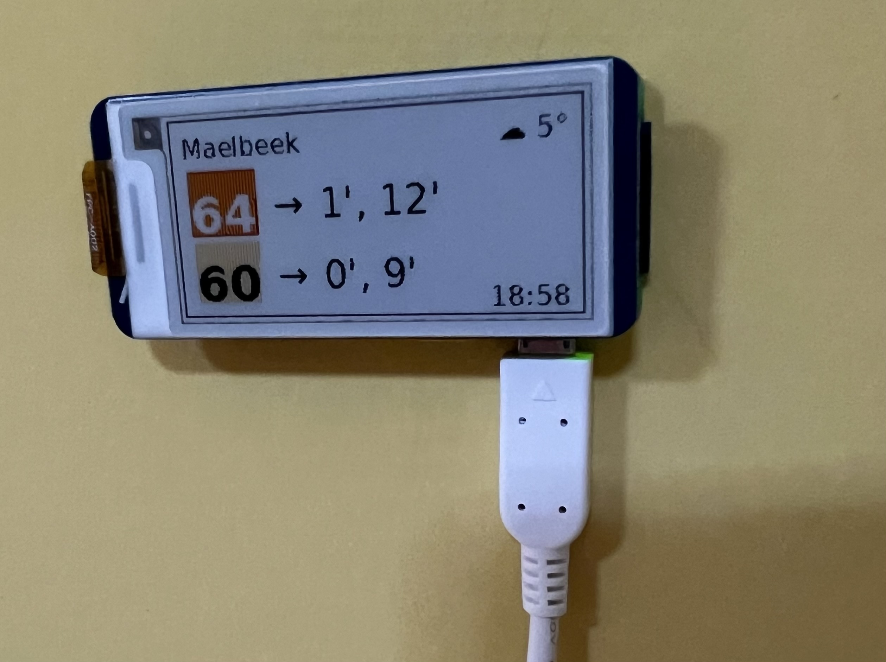
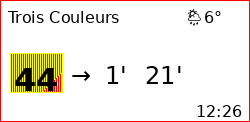

# Waiting Times Pi Display

A Raspberry Pi project that displays bus waiting times using an e-Paper display (Waveshare 2.13" G V2).


Features:
- Weather conditions and temperature (including a weather mode when no bus is coming soon)

    
- Next bus arrival times for configured lines (up to 2 lines at 1 stop)

    

- Color-coded bus line numbers matching STIB/MIVB official colors
- If the Raspberry Pi is not connected to the internet, it will set up a hotspot and display a QR code to connect to it that allows you to connect the Pi to the internet

    
- [Debugging interface](#debugging) to check the data being displayed

- WIP, optional: Displays flights that are overhead (in a set circle - 3 km by default)

# Requirements
The server from [my other repository](https://github.com/bdamokos/brussels_transit) is set up and is providing data for the stop we are interested in. It can run directly on the Raspberry Pi, or on a remote server. (You can choose between the two modes in the setup script.)

An [API key for OpenWeatherMap](https://openweathermap.org/appid) is required to get the weather data. (Optional, without an API key, the weather will not be displayed.)

## Hardware
This project has been tested with the hardware listed below. It should work with more powerful Raspberry Pi models. Different displays may require changes to the display code

Systems:
- [Raspberry Pi Zero 2W](https://www.raspberrypi.com/products/raspberry-pi-zero-2-w/)
  - Board with headers: ~€20
  - MicroSD card: €10-15 (tested with 16 and 32GB, should work with 8GB)
  - Official charger: €8 (if not using existing charging cable)
  - [USB-C to micro-USB adapter](https://www.raspberrypi.com/products/usb-b-to-usb-c-adapter/): €1

Displays:
- [Waveshare 2.13" G V2 e-Paper display](https://www.waveshare.com/2.13inch-e-Paper-HAT-G.htm) (black, white, red, yellow; no partial refresh support[^1]; ~€20) - display driver set as epd2in13g_V2 in the .env file
- [Waveshare 2.13" e-Paper display](https://www.waveshare.com/2.13inch-e-paper-hat.htm) (black, white; partial refresh support; ~€20) - display driver set as epd2in13_V4 in the .env file[^2]
- [Waveshare 2.13" e-Paper display with case](https://www.waveshare.com/2.13inch-Touch-e-Paper-HAT-with-case.htm) (black, white; partial refresh support; ~€20-€30) - display driver set as epd2in13_V4 in the .env file[^3]

Total cost of components: **~€60**

Can be extended with:
- [Battery pack, e.g. Pisugar 3](https://www.amazon.com/dp/B07Z333333)
- Case, e.g. 3D printed case or the one that comes with the display

[^1]: The four colour version of the display does not support partial refresh, so it flickers with every refresh, making it less ideal for this application, despite the nice colours.
[^2]: Good for our application, except it does not come with a case.
[^3]: Best for our application so far, as it comes with a case (intended for laying face up on a table, with a cable sticking out the back). Different cases for a vertical orientation would be better.
# Configuration

You can configure the display by editing the .env file directly, or by using the web interface that starts when you run the setup script.


The .env file is used to configure the application:
- Add your openweather API key
- Input your location (coordinates can be found on openstreetmap.org - right click your location and select "Show address")
- Configure the monitored transit stops (see readme at the [backend server](https://github.com/bdamokos/brussels_transit) on how to find stop IDs)
- Configure your display model

For manual editing:
``` bash
nano ~/display_programme/.env
```

For the web interface (assuming default host name _raspberrypi.local_): http://raspberrypi.local:5002/debug/env


# Setting up the Raspberry Pi
See [docs/setting up the Rpi.md](docs/setting%20up%20the%20Rpi.md)

## Uninstalling the display
Run [docs/service/uninstall_display.sh](docs/service/uninstall_display.sh) (which is copied to the home directory during setup or manually:
``` bash
curl -O https://raw.githubusercontent.com/bdamokos/rpi_waiting_time_display/main/docs/service/uninstall_display.sh
chmod +x uninstall_display.sh
sudo ./uninstall_display.sh
```

## Debugging
To enable debugging, set the debug_port_enabled=true in the .env (this is the default setting). This will start a flask server on the port specified in debug_port (5002 by default).
 
 Access the debug server at http://raspberrypi.local:5002/debug (or the host name of the Raspberry Pi if you have changed it, and the port specified in debug_port). The debug server is only accessible on the local network.


# Inspiration and similar projects
- A video ad STIB made for their mobile app

[](https://www.youtube.com/watch?v=scZsaJL7S8U)
- [This UK train waiting time display](https://github.com/chrisys/train-departure-display)


